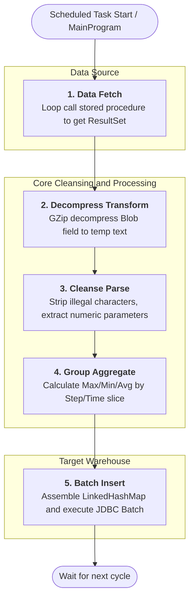

# FdcBlobLoader

## 1. Project Introduction
This project is designed for the semiconductor display industry (Array process). It is primarily used to parse binary equipment state parameter data (Blob data) that is uploaded by production equipment and stored in compressed format.

By extracting trace data generated by equipment, the program performs GZip decompression and parsing on Blob fields, then aggregates equipment parameters (e.g., maximum, minimum, average values) by Step (process step) and Time (shift). Finally, the structured metric data is stored in a data warehouse for subsequent FDC (Fault Detection and Classification) system monitoring and analysis.

---

## 2. Table Structure Description

### 2.1 Data Source Table (Read Source)
The program primarily reads compressed data from the equipment trace log table **`EQP_TRACE_TRX_FDC`**, with the following key fields:
| Column | Description |
| --- | --- |
| `EQP_MODULE_ID` / `UNIT_ID` | Equipment/Module ID |
| `SUBSTRATE_ID` | Glass substrate ID |
| `EQP_DCP_ID` | Data collection plan ID |
| `FILE_DATA` | Core binary Blob data field (contains GZip-compressed equipment Trace Data file stream) |
| `RSD_05` | Production Type |
| `OPERATION_ID` | Station/Operation ID |

### 2.2 Data Target Table (Write Target)
After cleansing and aggregation, data is batch-written to the **`EDS_FDC_TRACE`** table in the data warehouse (MDW), with the following table structure and field mappings:
| Column | Description |
| --- | --- |
| `START_TIMEKEY` | Start time |
| `END_TIMEKEY` | End time |
| `SHIFT_TIMEKEY` | Shift time, converted to standard A/B shift markers, e.g., 06:00 or 18:00 |
| `LOT_ID` | Lot ID |
| `GLASS_ID` | Glass substrate ID |
| `SLOT` | Slot number |
| `RECIPE` | Recipe |
| `PRODUCT_ID` | Product ID |
| `STEP_ID` | Process step ID |
| `STEP_NAME` | Process step name |
| `UNIT_ID` | Equipment/Module ID |
| `PTODUCTIONTYPE` | Production type |
| `OPER_ID` | Station operation ID |
| `ITEM` | Specific equipment parameter name |
| `VALUE_MIN` | Minimum value of the parameter within current Step and time period |
| `VALUE_MAX` | Maximum value of the parameter within current Step and time period |
| `VALUE_AVG` | Average value of the parameter within current Step and time period |

---

## 3. Technical Architecture and Code Structure

### 3.1 Technical Architecture
*   **Development Language**: Java 8
*   **Build Tool**: Maven (includes `maven-assembly-plugin` packaging mechanism)
*   **Database Connection**: JDBC (Oracle `ojdbc6`)
*   **Connection Pool Technology**: Supports and integrates multiple connection pools, such as **HikariCP** (default), **Druid**, **Commons-DBCP**, ensuring connection stability during high-volume data throughput.
*   **Logging Management**: Log4j / SLF4J

### 3.2 Code Architecture
The project adopts a layered architecture with the following core packages and functions:
*   **`blobdata/`**: Core business logic package.
    *   `MainProgram.java`: Main program entry, responsible for scheduled scanning/cyclic data fetching and invoking parsing logic.
    *   `FDCTraceParserBlob.java`: Core parsing class, implements building virtual memory tables (Table) from text, and calculates aggregated values of metrics grouped by Step and Time.
    *   `Table.java` & `AggregateFunction.java`: Abstract data memory table and aggregation metric entity classes.
*   **`Utils/`**: Utility class package.
    *   `DBUtil.java`: Core database operation class, implements calling stored procedures from data source to fetch Blob cursors, and batch-inserts computed results using `PreparedStatement.executeBatch()`.
    *   `FileUtils.java`: Implements GZip decompression of Blob data, reads text line by line, filters illegal characters, strips useless `@` symbols, and completes data cleansing transformation.
*   **`datapool/`**: Database connection pool configuration package. Encapsulates utility classes for Druid, DBCP, and HikariCP, supporting flexible switching.
*   **`config/`**: Configuration reading package. Used for reading database and connection pool `.properties` files, as well as handling Log output.

### 3.3 Core Processing Flow


---

## 4. Project Impact and Value

1. **Unlock "Black Box" Data Value**:
   Array process equipment typically generates extremely high-frequency and voluminous trace process parameters (e.g., various gas flow rates, temperatures, pressures, dry pump data). Due to volume constraints, this data is often stored in Blob (Gzip compressed) format, like a "black box". This project serves as the key to unlock this "black box", completely transforming unstructured text into easily queryable structured metrics.

2. **Support FDC Intelligent Early Warning, Improve Yield**:
   Through the Max/Min and Avg wide-table data produced by this project, upper-layer FDC (Fault Detection and Classification) systems or big data analytics platforms can easily draw control charts, calculate CPK and other quality metrics, enabling early warning for equipment state degradation and substrate defects. This is an important data foundation for improving factory process yield.

3. **High Performance and Automation**:
   The system combines custom memory data structures (Table) with pure streaming file parsing (BufferedReader) and batch commit (Batch Insert), ensuring robustness and low latency in the face of industrial high-volume high-frequency data. Meanwhile, fully automated background loop monitoring and fetching greatly saves previously complex manual intervention and data export costs, providing excellent business value for the digital and intelligent transformation of the semiconductor display industry.

---

## 5. Environment Requirements and Deployment

### 5.1 Environment Requirements
*   **Operating System**: Windows Server / Linux (Since the project provides `StartLoader.bat` script, Windows Server environment is recommended for deployment)
*   **Java Runtime Environment**: JDK 1.8 (Java 8) or above
*   **Build Tool**: Maven 3.x
*   **Database**: Oracle 11g or above (project depends on `ojdbc6.jar`)

### 5.2 Compile and Package
This project uses Maven for management and packaging. In development environment, use the following command to compile:
```bash
mvn clean package
```
*Note*: 
*   During compilation, `maven-assembly-plugin` will assemble structure according to `assembly/release.xml` configuration in the project.
*   After successful packaging, business code will be packaged into the main Jar, and required dependency directories (`lib/`) will be generated in `target/` or specified output directory.

### 5.3 Deployment Method
1. Copy the packaged core program Jar and the `lib/` folder containing all dependencies to the corresponding directory on the target server.
2. Copy configuration files from source code (`.properties` files in `src/main/resources/` and `config/` directory).
3. Ensure server network can correctly access upstream equipment Trace database and downstream data warehouse MDW.
4. Place startup script `StartLoader.bat` in the same directory as above folders.

### 5.4 Startup Method
Since the project provides batch command script by default, **Windows environment startup** is most straightforward:
1. Double-click `StartLoader.bat` in deployment directory or execute in cmd console:
```cmd
StartLoader.bat
```
*Startup Flow Explanation*:
1. The script automatically appends third-party Jar packages like Log4j, HikariCP, ojdbc6 from `lib/` directory to `CLASSPATH` environment.
2. Dedicated startup memory parameters are specified for JVM process (initial `-Xms1G`, maximum `-Xmx2G`), ensuring sufficient memory during high-frequency large object parsing.
3. If fetch time is not explicitly specified in startup parameters or property configuration (via `-DSTARTTIME="..."`), the program automatically sets fetch period to retrieve data from 120 minutes before current time.

---

## 6. O&M Commands and Monitoring Management

### 6.1 Common Parameter Modifications
During daily O&M maintenance, you can intervene by modifying variables inside `StartLoader.bat` script:
*   **Modify Start Fetch Time Point**:
    ```cmd
    set STARTTIME=20210301 090000
    ```
    (Note: For special data backfill needs, modify this date. Format: `yyyyMMdd HHmmss`)
*   **Modify JVM Heap Memory**:
    ```cmd
    set XMS=1G  :: Minimum heap memory
    set XMX=2G  :: Maximum heap memory
    ```

### 6.2 Log and Memory Analysis Diagnostics (Java Troubleshooting Methods)
To handle potential issues from industrial big data high load, the project not only has built-in automatic monitoring but also relies on standard Java troubleshooting tools:

#### 1. Business and Garbage Collection (GC) Log Analysis
*   **Business Application Log**:
    Daily database disconnection, text parsing errors etc. are output by `LogManager` and Log4j, specific path depends on `config/log4j.properties`. Use text tools for analysis, e.g., `grep "ERROR" log/xxx.log`.
*   **GC Auto Collection**:
    Script has built-in `-Xloggc:GCLOG/GC_BlobLoader_%DATE%.log` parameter. Generated log files can be directly imported to **[GCViewer](https://github.com/chewiebug/GCViewer)** or **GCEasy** tools to visually check Full GC frequency, whether new/old generation allocation is reasonable, and check if application has long STW (Stop-The-World) pauses.

#### 2. Memory Analysis (Memory & OOM)
Project may consume significant memory during large Blob decompression and LinkedHashMap assembly.
*   **Auto Dump**: Startup parameter enables `-XX:+HeapDumpOnOutOfMemoryError`. Once OOM crash occurs, system will generate snapshot file in `HeapDump/` folder (e.g., `BlobLoader_XXX.hprof`).
*   **Manual Dump (`jmap`)**: If program memory stays high but hasn't crashed, manually get live object snapshot via jmap:
    ```bash
    jmap -dump:live,format=b,file=heapDump.hprof <PID>
    ```
*   **Analysis Tool (MAT)**: After downloading generated `.hprof` file locally, open with **Eclipse MAT (Memory Analyzer Tool)**, use its built-in `Leak Suspects` report to directly locate largest collection objects or large object streams occupying memory.

#### 3. Thread and Performance Stuck Troubleshooting (Thread & CPU)
If program freezes, hangs, or CPU spikes (possibly DB connection not released, or loop blocked):
*   **Thread Snapshot (`jstack`)**:
    Use `jps` to find process PID, then execute:
    ```bash
    jstack -l <PID> > threadDump.txt
    ```
    Analyze thread states (`BLOCKED`, `WAITING`) in `threadDump.txt`, combined with deadlock detection, locate if there are database operation blocks or multi-thread hangs.
*   **Performance Hotspot Real-time Monitoring (`Arthas` or `VisualVM`)**:
    For zero-code-intrusion hot diagnosis, recommend Alibaba's open-source diagnostic tool **Arthas** (run `java -jar arthas-boot.jar`), use its `dashboard` command to real-time monitor threads and memory, or use `trace` to monitor `MainProgram` and `DBUtil` core method latency. Can also use JDK's built-in **jvisualvm** / **JConsole** to establish JMX connection in LAN for real-time GUI performance sampling.

---

## 7. Installation Guide

### 7.1 Get Code Repository
Clone or download source code from remote Git repository to local:
```bash
git clone <Repository_URL>
cd FdcBlobLoader
```

### 7.2 Import to Development Environment (IDE)
Recommend using IntelliJ IDEA or Eclipse for development:
*   **IntelliJ IDEA**: Click `File` -> `Open`, select `FdcBlobLoader` directory (or its `pom.xml` file), IDEA will automatically recognize it as Maven project and download dependencies.
*   *Note*: `ojdbc6.jar` is Oracle proprietary dependency, sometimes may not be automatically fetched from public Maven central repository. If dependency error occurs, manually add `ojdbc6` from archive or local to local Maven repository:
    ```bash
    mvn install:install-file -Dfile=/path/to/ojdbc6.jar -DgroupId=com.oracle.database.jdbc -DartifactId=ojdbc6 -Dversion=11.2.0.4 -Dpackaging=jar
    ```

### 7.3 Environment Configuration Modification
Before development or packaging, be sure to enter `src/main/resources/` or external `config/` directory, and modify corresponding database connection configurations (e.g., `druidconfig.properties`, `hikaricp.properties`, and `BlobLoader.properties`) according to development/test environment needs.

---

## 8. Future Plans and Extensions

To meet larger scale and more complex intelligent manufacturing scenarios, this project has the following extension plans:

1. **Cross-Platform Script Support**:
   Currently the project mainly supports Windows batch `.bat`. Future plan to add `StartLoader.sh` and systemd-based daemon service file for better support of unattended deployment on CentOS/Ubuntu Linux production servers.
   
2. **Containerization Evolution**:
   Plan to introduce `Dockerfile` and `docker-compose.yml` to package Java runtime, application dependencies, and external configuration into images. Deploy via Docker or K8S for elastic scaling to support multi-factory, multi-equipment isolated independent fetching.

3. **Dynamic Configuration Hot Reload**:
   Currently every modification of database source, connection pool size, or fetch strategy requires restarting script and JVM process. Future plan to integrate distributed configuration centers like Nacos or Apollo for real-time configuration change effect (hot update), ensuring pipeline non-stop.

4. **Exception Monitoring and Alert Notification Integration**:
   Strengthen current exception capture module. Besides local logs, integrate OOM exceptions, continuous database disconnection, decompression failures and other severe alerts into enterprise office suites like Feishu, DingTalk, or connect to internal Prometheus+Grafana dashboard for visual monitoring.
