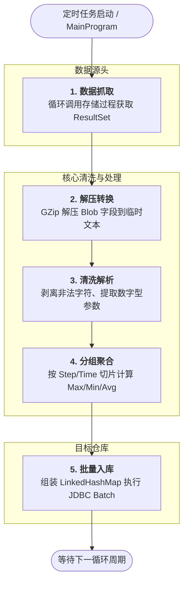

# FdcBlobLoader

## 1. 项目简介 (Project Introduction)
本项目应用于半导体显示行业（Array 工艺）。主要用于解析生产设备上传并压缩存储的二进制设备状态参数数据（Blob 数据）。
通过提取设备产生的检测数据（Trace Data），程序将 Blob 字段进行 GZip 解压缩、解析清洗，并按 Step（工序）和时间（班次）对各项设备的参数进行聚合计算（如：最大值、最小值、平均值），最终将结构化的指标数据转存至数据仓库中，供后续 FDC（Fault Detection and Classification，故障检测与分类）系统进行监控和分析。

---

## 2. 表结构说明 (Table Structures)

### 2.1 数据读取表 (Read Source)
程序主要从设备追踪日志表 **`EQP_TRACE_TRX_FDC`** 中读取压缩数据，主要涉及的字段包括：
| 字段名称 (Column) | 说明 (Description) |
| --- | --- |
| `EQP_MODULE_ID` / `UNIT_ID` | 设备/模组ID |
| `SUBSTRATE_ID` | 玻璃基板ID |
| `EQP_DCP_ID` | 数据采集计划ID |
| `FILE_DATA` | 核心二进制 Blob 数据字段（存放 GZip 压缩的设备 Trace Data 文件流） |
| `RSD_05` | 生产类型 (Production Type) |
| `OPERATION_ID` | 站点/操作ID |

### 2.2 数据写入表 (Write Target)
清洗并经过聚合计算后的数据会被批量写入到数据仓库（MDW）的 **`EDS_FDC_TRACE`** 表中，其表结构及字段映射如下：
| 字段名称 (Column) | 说明 (Description) |
| --- | --- |
| `START_TIMEKEY` | 开始时间 |
| `END_TIMEKEY` | 结束时间 |
| `SHIFT_TIMEKEY` | 班次时间，转换为标准的A/B班标记，如06:00或18:00 |
| `LOT_ID` | 批次号 |
| `GLASS_ID` | 玻璃基板ID |
| `SLOT` | 插槽号 |
| `RECIPE` | 配方/Recipe |
| `PRODUCT_ID` | 产品ID |
| `STEP_ID` | 工序ID |
| `STEP_NAME` | 工序名称 |
| `UNIT_ID` | 设备/模组ID |
| `PTODUCTIONTYPE` | 生产类型 |
| `OPER_ID` | 站点操作ID |
| `ITEM` | 具体的设备参数名称 |
| `VALUE_MIN` | 该参数在当前Step和时间段内的最小值 |
| `VALUE_MAX` | 该参数在当前Step和时间段内的最大值 |
| `VALUE_AVG` | 该参数在当前Step和时间段内的平均值 |

---

## 3. 技术架构与代码架构

### 3.1 技术架构
*   **开发语言**: Java 8
*   **构建工具**: Maven (包含 `maven-assembly-plugin` 打包机制)
*   **数据库连接**: JDBC (Oracle `ojdbc6`)
*   **连接池技术**: 支持且集成了多种连接池，如 **HikariCP** (默认使用)、**Druid**、**Commons-DBCP**，保障海量数据吞吐时的连接稳定性。
*   **日志管理**: Log4j / SLF4J

### 3.2 代码架构
项目采用分层架构，核心包及功能如下：
*   **`blobdata/`**: 业务核心逻辑包。
    *   `MainProgram.java`: 程序主入口，负责定时扫描/循环拉取数据，并调用解析逻辑。
    *   `FDCTraceParserBlob.java`: 核心解析类，实现从文本中构建虚拟内存表（Table），并按 Step 和 Time 分组计算各项指标的聚合值。
    *   `Table.java` & `AggregateFunction.java`: 抽象的数据内存表及聚合指标实体类。
*   **`Utils/`**: 工具类包。
    *   `DBUtil.java`: 数据库操作核心类，实现从数据源调用存储过程拉取 Blob 游标，并将计算好的结果利用 `PreparedStatement.executeBatch()` 批量入库。
    *   `FileUtils.java`: 实现 Blob 数据的 GZip 解压，并逐行读取文本，过滤非法字符、剥离无用 `@` 符号，完成数据的清洗转换。
*   **`datapool/`**: 数据库连接池配置包。封装了 Druid、DBCP 和 HikariCP 的工具类，支持灵活切换。
*   **`config/`**: 配置读取包。用于读取数据库及连接池的 `.properties` 文件，以及处理 Log 输出。

### 3.3 核心处理流程


---

## 4. 项目的影响力与使用价值

1. **变废为宝，解锁“黑盒”数据价值**：
   Array 制程设备通常会产生频率极高、体积庞大的 Trace 过程参数（例如各种气体流量、温度、压力、干泵数据等）。这些数据因为体积问题常以 Blob (Gzip 压缩) 的格式进行存储，如同“黑盒”。本项目作为解密“黑盒”的钥匙，将非结构化文本彻底转换为了易于查询的结构化指标。

2. **支撑 FDC 智能预警，提升良率**：
   通过本项目产出的各参数极值 (Max/Min) 和均值 (Avg) 宽表数据，上层的 FDC（故障检测与分类系统）或大数据分析平台，能够轻松绘制控制图 (Control Chart)、计算 CPK 等质量指标，实现对机台状态劣化和基板缺陷的早期预警，是提升工厂工艺良率的重要数据底座。

3. **高性能与自动化**：
   系统通过自定义的内存数据结构（Table）与纯流式文件解析（BufferedReader）、批处理提交（Batch Insert）相结合，确保了在工业界海量高频数据面前的稳健与低延迟。同时后台全自动化循环监控拉取，极大节省了原先繁杂的人工干预和数据导出成本，对半导体显示行业的数字化和智能化转型有着卓越的业务价值。

---

## 5. 环境要求与部署启动 (Environment & Deployment)

### 5.1 环境要求
*   **操作系统**: Windows Server / Linux (由于项目中提供 `StartLoader.bat` 脚本，推荐使用 Windows Server 环境部署)
*   **Java 运行环境**: JDK 1.8 (Java 8) 及以上版本
*   **构建工具**: Maven 3.x
*   **数据库**: Oracle 11g 及以上版本 (项目依赖 `ojdbc6.jar`)

### 5.2 编译与打包
本项目使用 Maven 进行管理和打包。开发环境中可以使用以下命令进行编译：
```bash
mvn clean package
```
*说明*: 
*   编译时，`maven-assembly-plugin` 会根据项目中 `assembly/release.xml` 的配置进行结构组装。
*   打包成功后，会将业务代码打入主 Jar 包，并在 `target/` 或指定输出目录下生成运行所需的依赖包目录（`lib/`）。

### 5.3 部署方式
1. 将打包输出的核心程序 Jar 包及存放所有依赖环境的 `lib/` 文件夹复制至目标服务器对应目录。
2. 拷贝源代码中的配置文件（位于 `src/main/resources/` 的 `.properties` 以及 `config/` 目录）。
3. 确保服务器网络能够正确访问上游设备 Trace 库以及下游数据仓库 MDW。
4. 将启动脚本 `StartLoader.bat` 放置于上述文件夹的同一级目录。

### 5.4 启动方式
由于项目中默认提供了批处理命令脚本，**Windows 环境下启动**最为直接：
1. 双击部署目录下的 `StartLoader.bat` 或在 cmd 控制台执行：
```cmd
StartLoader.bat
```
*启动流程解析*:
1. 脚本会自动将 `lib/` 目录下的如 Log4j、HikariCP、ojdbc6 等第三方 Jar 包拼接到 `CLASSPATH` 环境中。
2. 为 JVM 进程指定了专用的启动内存参数（初始值 `-Xms1G`，最大值 `-Xmx2G`），保障高频大对象解析时内存充裕。
3. 若无在启动参数或属性配置中显式指定拉取时间（通过 `-DSTARTTIME="..."`），程序会自动将抓取周期设定为从当前时间回退 120 分钟的数据。

---

## 6. 运维命令与监控管理 (O&M and Monitoring)

### 6.1 常用参数修改
在运维日常维护过程中，可以通过修改 `StartLoader.bat` 脚本内部的变量来进行干预操作：
*   **修改起始拉取时间点**:
    ```cmd
    set STARTTIME=20210301 090000
    ```
    (注：如遇特殊补数据需求，修改此处日期即可，格式：`yyyyMMdd HHmmss`)
*   **修改 JVM 堆内存**:
    ```cmd
    set XMS=1G  :: 最小堆内存
    set XMX=2G  :: 最大堆内存
    ```

### 6.2 日志与内存分析诊断 (Java 故障排查手段)
为应对工业大数据高负载可能产生的问题，项目不仅内建了自动监控，还依赖标准的 Java 排查工具：

#### 1. 业务与垃圾回收 (GC) 日志分析
*   **业务应用日志**:
    日常数据库失联、文本解析报错等由 `LogManager` 及 Log4j 输出，具体路径依赖 `config/log4j.properties`。排查时可使用文本工具分析，如 `grep "ERROR" log/xxx.log`。
*   **GC 自动收集**:
    脚本内置了 `-Xloggc:GCLOG/GC_BlobLoader_%DATE%.log` 参数。生成的日志文件可直接导入至 **[GCViewer](https://github.com/chewiebug/GCViewer)** 或 **GCEasy** 等工具，以可视化形式排查 Full GC 频率、新生代/老年代的分配是否合理，排查应用是否有 STW (Stop-The-World) 停顿过长的问题。

#### 2. 内存分析 (Memory & OOM)
项目在大量 Blob 数据解压与 LinkedHashMap 组装时可能消耗较多内存。
*   **自动 Dump**: 启动参数中启用了 `-XX:+HeapDumpOnOutOfMemoryError`。一旦发生 OOM 崩溃，系统将在 `HeapDump/` 文件夹下生成快照文件（如 `BlobLoader_XXX.hprof`）。
*   **手动 Dump (`jmap`)**: 若发现程序占用内存居高不下但并未崩溃，可手动通过 jmap 获取存活对象快照：
    ```bash
    jmap -dump:live,format=b,file=heapDump.hprof <PID>
    ```
*   **分析工具 (MAT)**: 将生成的 `.hprof` 文件下载到本地后，使用 **Eclipse MAT (Memory Analyzer Tool)** 打开，通过其自带的 `Leak Suspects` 报告，可以直接定位到占用内存最大的集合对象或大对象流。

#### 3. 线程与性能卡顿排查 (Thread & CPU)
若发现程序卡死、假死或 CPU 飙高（可能是 DB 连接未释放，或循环阻塞）：
*   **线程快照 (`jstack`)**:
    使用 `jps` 找到进程 PID 后，执行：
    ```bash
    jstack -l <PID> > threadDump.txt
    ```
    通过分析 `threadDump.txt` 中的线程状态（`BLOCKED`, `WAITING`），结合死锁检测，定位是否有数据库操作阻塞或多线程挂起。
*   **性能热点实时监控 (`Arthas` 或 `VisualVM`)**:
    如果需要零代码入侵的热诊断，推荐引入阿里开源诊断利器 **Arthas**（运行 `java -jar arthas-boot.jar`），使用其 `dashboard` 命令实时监控线程和内存，或者使用 `trace` 监控 `MainProgram` 和 `DBUtil` 内核方法的耗时情况。也可以在局域网内通过 JDK 自带的 **jvisualvm** / **JConsole** 建立 JMX 连接，进行实时的 GUI 性能采样。

---

## 7. 安装方式 (Installation Guide)

### 7.1 获取代码库
从远端 Git 仓库克隆或下载源代码包至本地：
```bash
git clone <Repository_URL>
cd FdcBlobLoader
```

### 7.2 导入开发环境 (IDE)
推荐使用 IntelliJ IDEA 或 Eclipse 进行开发：
*   **IntelliJ IDEA**: 依次点击 `File` -> `Open`，选择 `FdcBlobLoader` 目录（或其 `pom.xml` 文件），IDEA 将自动识别其为 Maven 项目并下载依赖。
*   *注意*: `ojdbc6.jar` 属于 Oracle 私有依赖，有时可能无法从公共 Maven 中央仓库自动拉取。若遇到依赖报错，需手动将压缩包内或本地提供的 `ojdbc6` 加入本地 Maven 仓库：
    ```bash
    mvn install:install-file -Dfile=/path/to/ojdbc6.jar -DgroupId=com.oracle.database.jdbc -DartifactId=ojdbc6 -Dversion=11.2.0.4 -Dpackaging=jar
    ```

### 7.3 环境配置修改
在开发前或打包前，务必进入 `src/main/resources/` 或外部 `config/` 目录，按开发/测试环境所需，修改对应的数据库连接配置（如 `druidconfig.properties`、`hikaricp.properties` 以及 `BlobLoader.properties`）。

---

## 8. 后续计划与扩展 (Future Plans)

为了满足更大规模及更复杂的智能制造场景需求，本项目在未来具有以下扩展规划：

1. **多平台脚本支持 (Cross-Platform Scripts)**：
   目前项目主推 Windows 平台批处理 `.bat`。后续计划补充 `StartLoader.sh` 及基于 `systemd` 的守护进程服务文件，以更好地支持 CentOS/Ubuntu 等 Linux 生产服务器的无人值守部署。
   
2. **容器化演进 (Containerization)**：
   计划引入 `Dockerfile` 和 `docker-compose.yml`，将 Java 运行环境、应用依赖、外部配置打包为镜像。通过 Docker 或 K8S 部署，实现弹性伸缩以支持多厂区、多设备的隔离化独立拉取。

3. **动态配置热加载 (Dynamic Configuration)**：
   目前每次修改数据库源、连接池大小、甚至拉取策略，都需要重启脚本及 JVM 进程。未来考虑集成诸如 Nacos 或 Apollo 等分布式配置中心，实现配置变更实时生效（热更新），确保流水线不停机。

4. **异常监控与报警通知集成 (Alerting System)**：
   加强当前的异常捕获模块，除了本地日志外，将 OOM 异常、数据库持续掉线、解压失败等重度告警行为接入飞书、钉钉等企业办公套件，或者对接企业内部的 Promethus+Grafana 面板进行可视化监控。
